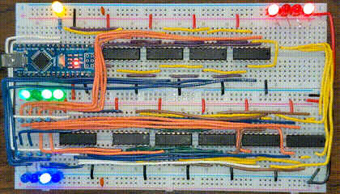

## Overview

The Arduino Adder Unit was made in October 2021 during PLTW Digital
Electronics class.  The user inputs a valid expression into the Arduino
serial monitor, where the Arduino outputs the expected result in a
4-bit system.  At the same time, it loads the binary data of the
operands onto a shift register, which from there the physical
result is calculated using combinational logic circuitry.

The circuit is essentially the work of YouTube user Ben Eater, with both
the D flip-flop shift register and combinational logic circuitry
derived from his implementations.  These are basic digital logic
topics I would later formally learn in university, but Eater made them
accessible to anyone interested in electronics.

The Arduino code is entirely my own work.  Originally written in
October 2021, and revisited in March 2023 for cleaning and bug fixing,
the program's job is strictly to translate human input into digital
signals, and to verify the circuit results.  


## Usage

Build the circuit described by the schematic in `kicad/schematic.pdf`.

Clone the repository using

``` sh
git clone https://github.com/WGeckle80/arduino-adder-unit.git
```

Open `arduino-adder-unit.ino` in the Arduino IDE, and upload the
sketch to your Arduino of choice.  Open the serial monitor in the IDE.
You should see the following message:

```
Enter a valid binary operation with a and b in [-8, 7]:
"a + b", "a - b"
```

Type in a valid expression such as `-8 - 7`, and take note of the
output.  Since the arithmetic system is 4 bits, the serial monitor
should display `-8-7=1`, with the corresponding physical output being
0001.




## References

Ben Eater.  (2016).  ALU Design.
<https://www.youtube.com/watch?v=mOVOS9AjgFs&ab_channel=BenEater>

Ben Eater.  (2017).  Build an Arduino EEPROM programmer.
<https://www.youtube.com/watch?v=K88pgWhEb1M&ab_channel=BenEater>

Ben Eater.  (2015).  Learn how computers add numbers and build a 4 bit
adder circuit.
<https://www.youtube.com/watch?v=wvJc9CZcvBc&ab_channel=BenEater>

Ben Eater.  (2016).  Twos Complement: Negative numbers in binary.
<https://www.youtube.com/watch?v=4qH4unVtJkE&ab_channel=BenEater>

